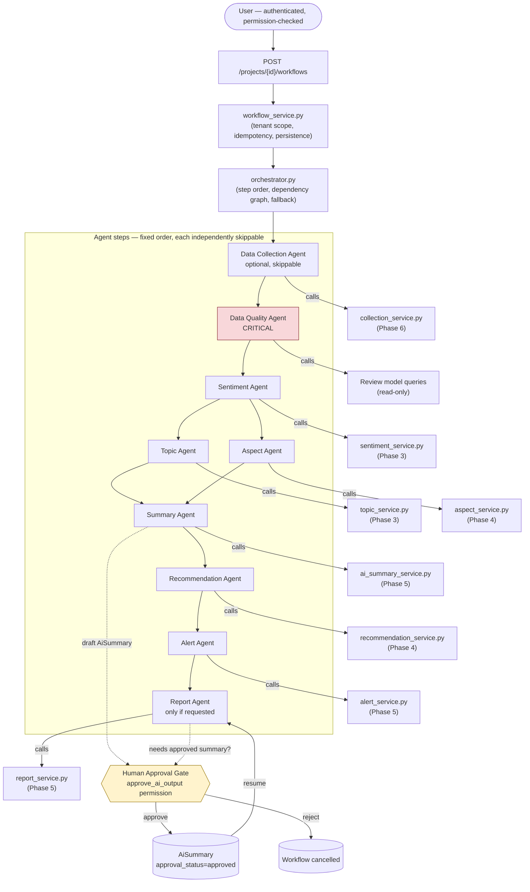

# Agentic Architecture (Phase 7)

This document describes the actual Phase 7 implementation: a deterministic
orchestrator coordinating nine thin agent wrappers, each calling one
already-existing, already-tested service. No agent implements independent
business logic — see `docs/phase6_agent_handoff.md` for the equivalent
Phase 6 contract this builds on.

## Overview

## Step order and dependency graph

Fixed order: `data_collection → data_quality → sentiment → topic → aspect →
summary → recommendation → alert → report`. Not every step runs in every
workflow — see [Workflow types](#workflow-types) — and a step only ever
runs if its underlying permission is held (see
[Permission inheritance](#permission-inheritance)).

**Critical vs. optional** (`app/services/agents/orchestrator.py::BLOCKS_ON_FAILURE`):
- `data_quality` is the only **critical** step — its failure stops the
  whole workflow (`status: "failed"`), since nothing downstream should run
  against unknown data quality.
- `sentiment` failing skips `topic` and `aspect` (they'd otherwise run
  against an inconsistent analytical picture), but does **not** stop the
  workflow — `summary`/`recommendation`/`alert`/`report` still attempt to
  run against whatever data exists, degrading gracefully rather than
  failing outright.
- Every other step failing or being skipped (missing permission,
  insufficient data, disabled feature) produces `status:
  "completed_with_warnings"` for the overall workflow, never blocks
  unrelated steps.

## Workflow types

| Type | Steps included by default |
|---|---|
| `FULL_ANALYSIS` | data_quality, sentiment, topic, aspect, summary, recommendation, alert |
| `COLLECT_AND_ANALYSE` | data_collection + everything in `FULL_ANALYSIS` |
| `REFRESH_ANALYSIS` | data_quality, sentiment, topic, aspect (no summary/recommendation/alert) |
| `EXECUTIVE_BRIEF` | summary, recommendation only |
| `ALERT_RECHECK` | alert only |
| `REPORT_REFRESH` | report only |

Any step can be explicitly forced on/off per request via `options`
(`collectNewData`, `runSentiment`, `runTopics`, `runAspects`,
`generateSummary`, `generateRecommendations`, `evaluateAlerts`,
`generateReport`) — workflow-type defaults are just defaults, never a hard
requirement to run every agent.

## Human Approval Gate

The **only** built-in approval gate in Phase 7 is the report step's
dependency on an approved AI summary: if a workflow requests
`generateReport` with `includeAiSummary` (the default) and no summary for
the project has been approved yet, `ReportAgent` returns
`status: "waiting_for_approval"` instead of silently generating an
incomplete report or approving the draft itself. The workflow's overall
`status` becomes `waiting_for_approval`; a human calls
`POST /workflows/{id}/approve` (which approves the underlying draft
`AiSummary` via the existing, unchanged Phase 5 endpoint logic, gated on
`approve_ai_output`) and then `POST /workflows/{id}/resume` to re-attempt
just the report step.

No agent ever approves its own output, accepts its own recommendation, or
resolves its own alert — see `docs/phase6_deferred_issues.md`-equivalent
guarantees restated per-agent in each agent module's docstring.

## Existing internal services (unchanged, independently usable)

Every agent is a thin wrapper — the actual logic lives entirely in
services that predate Phase 7 and remain fully usable through their
original, unchanged API endpoints:

| Agent | Calls | Since |
|---|---|---|
| Data Collection | `collection_service.collect_enabled_sources_for_project` | Phase 6 |
| Data Quality | `Review` model queries (read-only) | Phase 2 |
| Sentiment | `sentiment_service.run_analysis` | Phase 3 |
| Topic | `topic_service.run_topic_analysis` | Phase 3 |
| Aspect | `aspect_service.run_aspect_analysis` | Phase 4 |
| Summary | `ai_summary_service.create_summary` | Phase 5 |
| Recommendation | `recommendation_service.generate_recommendations` | Phase 4 |
| Alert | `alert_service.evaluate_project_alerts` | Phase 5 |
| Report | `report_service.create_report` | Phase 5 |

## Fallback-first guarantee

Every one of these services already works with zero AI/LLM/scraping
configuration:
- Sentiment/Topic/Aspect: deterministic (VADER, TF-IDF+KMeans, dictionary
  matching) — no model download, no network call.
- Summary/Recommendation: deterministic templates
  (`app/services/agents/provider.py::DeterministicProvider`) — no LLM.
- Data Collection: degrades to "use existing data" if disabled, blocked by
  policy, or a source is unreachable — never blocks the rest of the
  workflow (`data_collection` is never a critical step).
- Report: omits any section with no underlying data rather than failing.

The whole system — orchestrator included — runs correctly with **no**
LangGraph, **no** LLM provider, and **no** enabled data sources configured.

## Security boundaries

- **Tenant isolation**: every workflow is bound to `organisation_id` +
  `project_id` at creation (`project_access_required` decorator, same as
  every other project-scoped resource); every by-ID route
  (`workflow_access_required`) re-derives the owning organisation from the
  database, never trusts a client-supplied ID in isolation. See
  `app/decorators/auth.py::workflow_access_required`.
- **Permission inheritance**: no new permission catalogue — each agent's
  `required_permission` is one of the *existing* codes
  (`manage_data_sources`, `view_reviews`, `generate_report`,
  `manage_alerts`) already used by that operation's own direct endpoint. A
  workflow never bypasses a permission a direct API call would also need.
- **Tool allowlist**: agents call named Python functions in existing
  service modules — `collect_source`, `run_analysis`,
  `run_topic_analysis`, `run_aspect_analysis`, `create_summary`,
  `generate_recommendations`, `evaluate_project_alerts`, `create_report`.
  Nothing resembling shell execution, arbitrary SQL, `eval`/`exec`, or
  free-form HTTP requests to agent/model-supplied URLs is exposed anywhere
  in this layer.
- **Prompt-injection / untrusted data**: there is no LLM in this phase, so
  there is no prompt to inject into — but the guarantee is still real and
  tested (`tests/test_workflows.py::test_malicious_review_text_remains_inert_data`):
  review text is only ever read as plain data by every service in this
  chain (VADER scores it, TF-IDF vectorizes it, string templates quote
  it) — never parsed as an instruction, never triggers a privileged
  action, regardless of its content.
