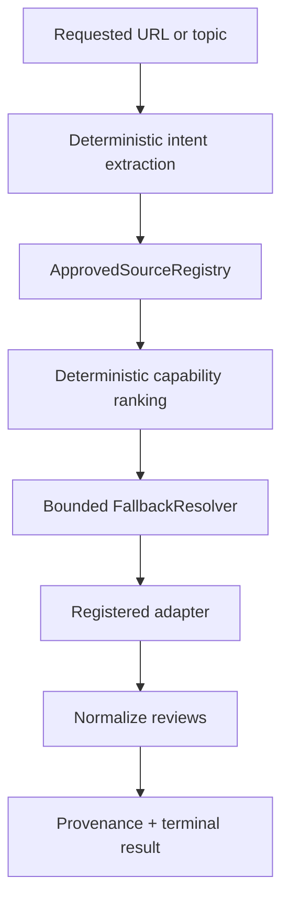
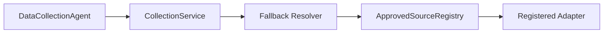

# Architecture

Future production flow only (not implemented):

The agent must never call the resolver directly. Discovery is informational only; it cannot add sources or fetch arbitrary endpoints. Adapters cannot receive a resolver reference, so recursive fallback is structurally excluded.
